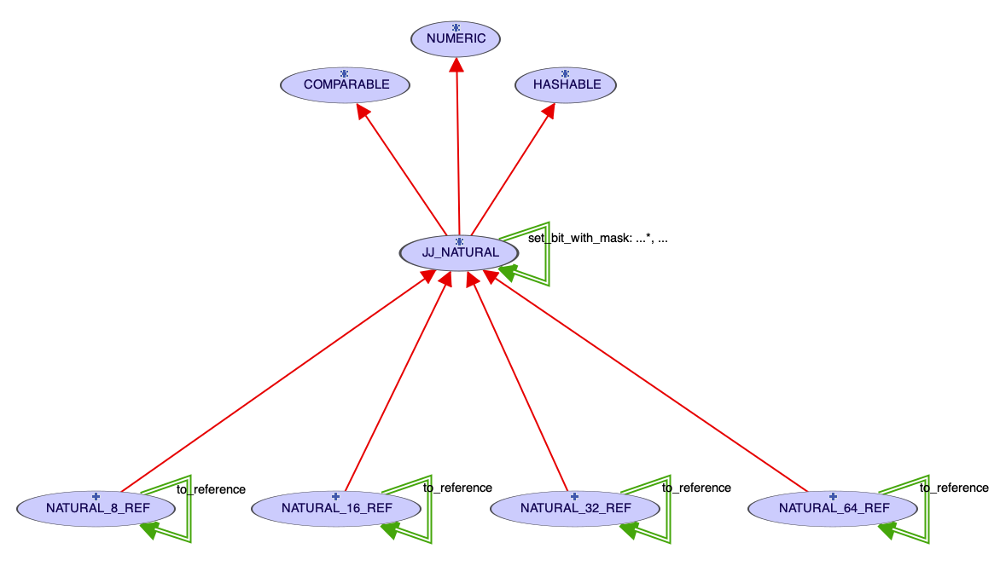

# jj_naturals
This repository is built on the idea that the Eiffel Software NATURAL\_xxx classes should have a common ancestor, allowing those NATURAL\_xxx classes to be used in a generic context.  This context is obtained by inserting class [JJ_NATURAL](./jj_override/jj_natural.e) between NUMERIC and all the NATURAL\_xx\_REF classes.

There is no library ecf file for these classes.  To use this cluster's classes, include the files from the [jj_override](./jj_override) cluster in your project's overrides project setting.

As ancestor to the NATURAL\_xx classes, the [JJ_NATURAL](./jj_override/jj_natural.e) class allows for generic programming when the size of the natural (8, 16, 32, or 64-bits) does not matter and it wraps the COMPARABLE property.  Using these override classes does not change does not change programmer interaction with the natural classes; the original classes have the same interface. 

_I understand that theoretically some NUMERIC types (e.g. imaginary numbers) are comparable, but for practical usage, I think bending that rule would be better._

See the [secure-hash-algorithm classes](http://github.com/boxer41a/jj_sha) for an example use of this cluster.  The SHA classes seem elegant because the generic use of JJ\_NATURAL eliminates a lot code duplication that would be required without these override classes.  Also, the bit operations included in JJ\_NATURAL would have to be accessed through some type of facilities class. 

The elegance comes at a price.  It seems that the runtime may be unable to use the built-in access to the values [though item?] and is using a function call instead.  This seems to cause a slowing of programs that use this cluster.